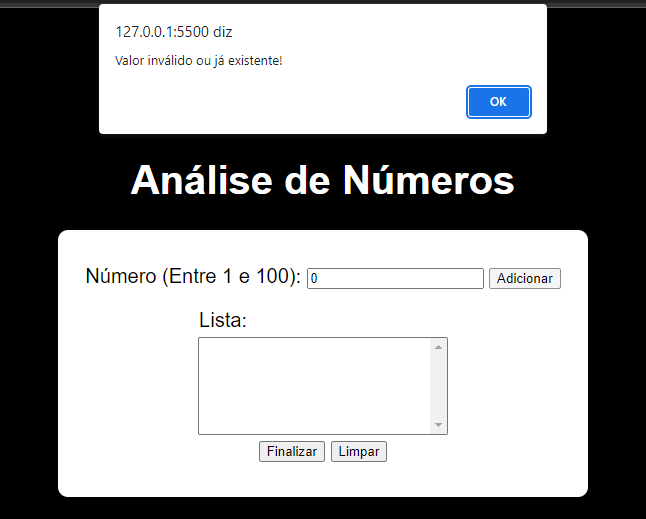
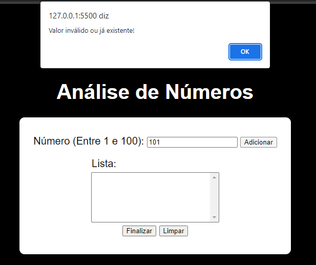
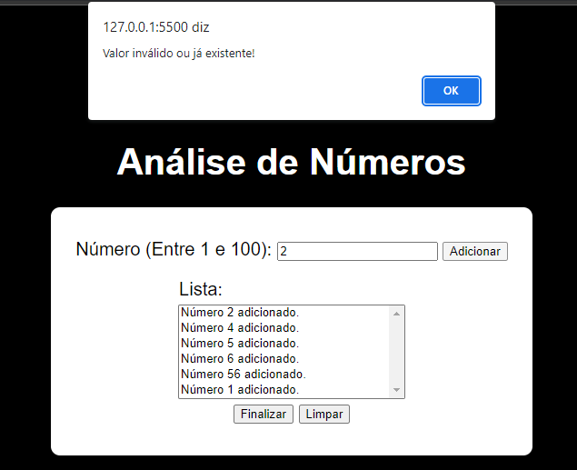
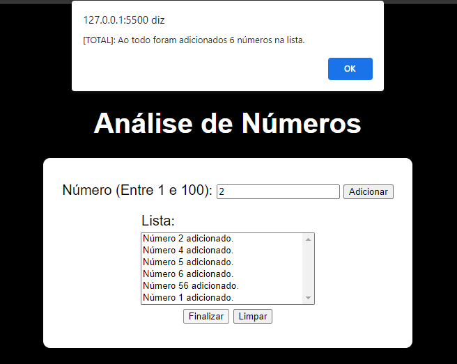
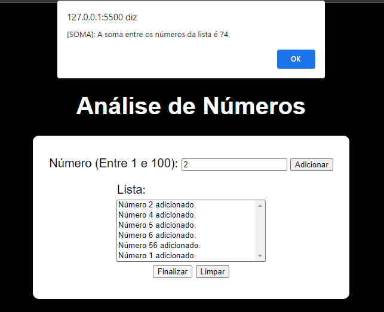
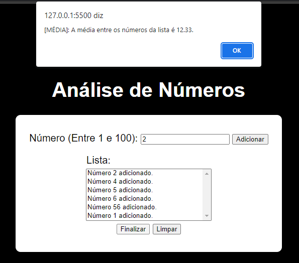
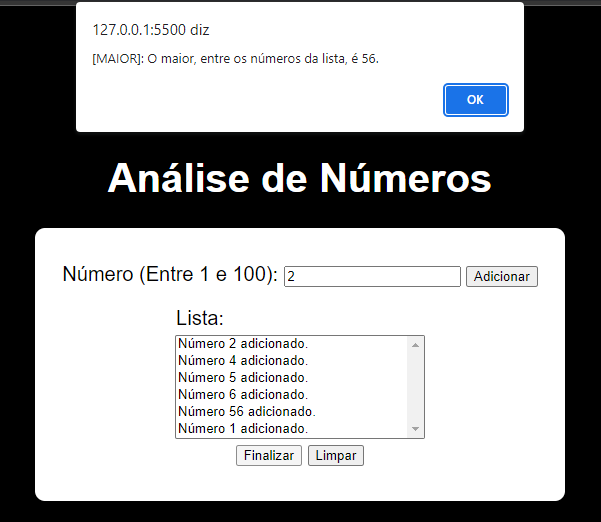

<h3>Análise de Números</h3> 

Exercício extra proposto que se baseia em analisar números, entre 1 e 100, em uma lista e realizar ações com eles.   

   

Se o número digitado for menor que 1 ou maior que 100 o usuário é alertado que o número é inválido, o mesmo vale para tentar adicionar com a área vazia.   

   

Não é possível adicionar um número que já está na lista, quando o usuário digita um número repetido e tenta adicioná-lo, o alerta de número inválido ou já existente é acionado.   

   

Ao clicar no botão "Finalizar" o programa analisa os números da lista e retorna algumas informações, entre elas, o total de número presentes na lista, a soma desses números, a média deles, dentre eles qual o maior e qual o menor.   

   

 Vale lembrar que ao se tentar finalizar sem dados na lista também é retornado um alerta que não é possível prosseguir sem os dados e por fim, o botão "Limpar" tem a função de apagar os dados da lista.   
